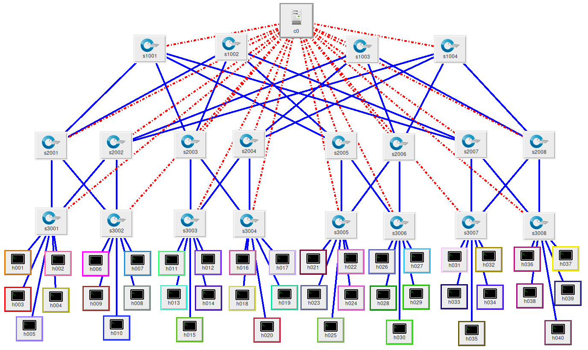
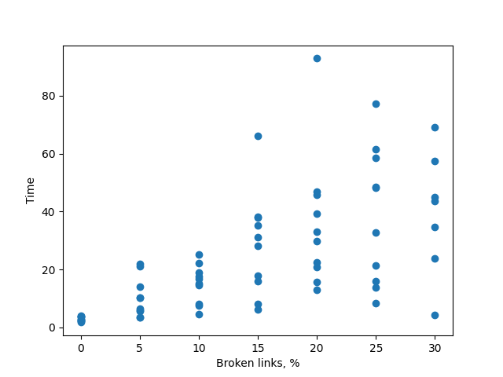
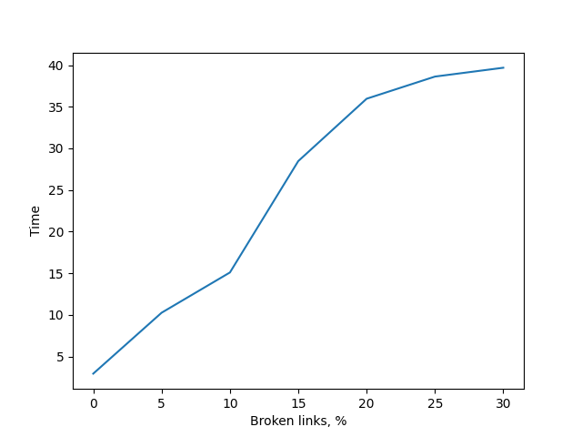
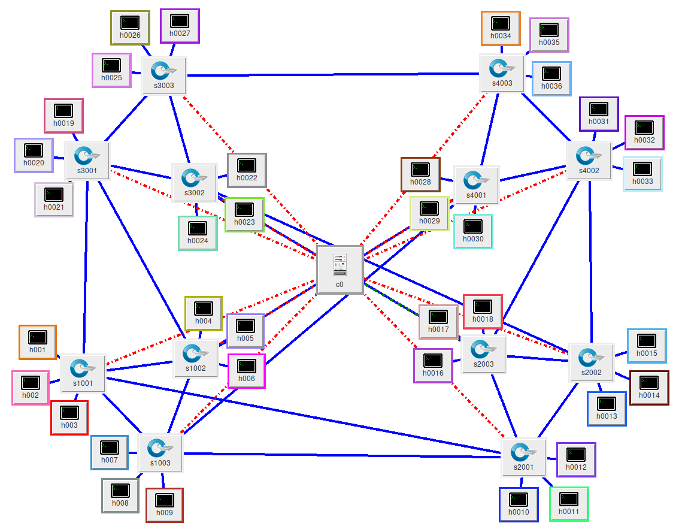
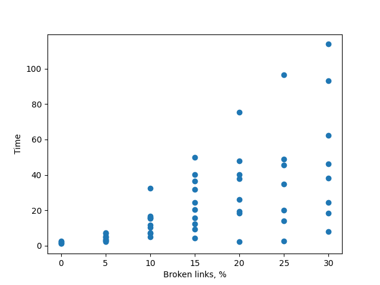
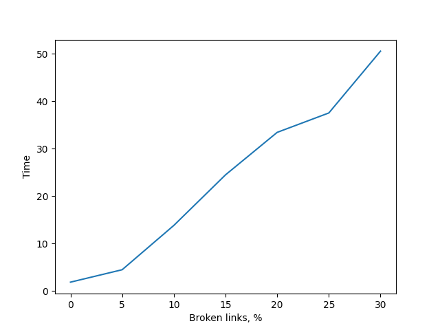

Emulation of MPI cluster with Fat Tree and Dragonfly topologies using Containernet.

Проект выполнен в рамках курса "Основы Grid и Cloud вычислений", СПбГУ,
факультет ПМ-ПУ.
## Installation
Project relies on the specific environment, described below

1. Get Containernet sources:

```
$ git clone https://github.com/containernet/containernet.git
$ cd containernet
```

2. Get POX networking software platform and checkout to branch DART:

```
$ git clone https://github.com/noxrepo/pox
```

3. Clone this repository:

```
$ git clone https://github.com/vanyaio/mininet-mpi
```

Please note that you must end up with the following tree structure:

```
├── containernet
│   ├── mininet-mpi
│   └── pox
```

If you prefer containernet to be run bare-metal, see "Bare-metal installation" in
containernet repository with development installation (sudo make develop). Note that on Ubuntu 20.04 you likely have to install net-tools with 'sudo apt install net-tools'.
Otherwise use Vagrant: https://www.vagrantup.com/docs/installation

## Usage

Put your MPI application to mininet-mpi/mpi-app with its Makefile or stay
with example broadcasting application.

For single cluster run with Vagrant change directory to containernet and ssh Vagrant box:

```
$ vagrant up
$ vagrantup ssh
vagrant@ubuntu$ cd /home/ubuntu/containernet/mininet-mpi
```

Or with bare-metal installation, change directory to mininet-mpi.

There are two network topologies to choose from: 'fattree' and 'dragonfly'.

When choosing a 'fattree' topology you may export following environment variables:
- PODS - number of pods in fat-tree topology, default value 4
- DENSITY - density of fat-tree topology (nubmer of nodes for each edge switch), default value 1

If the 'dragonfly' topology is selected you may export following environment variables:
- NUM_GROUPS - number of switch groups, default value 4
- NUM_SW_IN_GROUP - number of switches in the group, default value 3
- NUM_HOSTS_FOR_SW - number of hosts for each switch, default value 1
- NUM_INTER_LINKS - number of inter-links for each switch, default value 1

And also PACKET_LOSS - percentage of broken links with packets loss, default is 0

Run:
> To use 'fattree', run script './run.sh' with 'fattree' or empty argument\
> To use 'dragonfly', run script './run.sh' with 'dragonfly' argument

```
vagrant@ubuntu$ cd /home/ubuntu/containernet/mininet-mpi
vagrant@ubuntu$ sudo -E ./run.sh
```

And finally see application output.

To gather statics you can use stats_run.sh script, which runs app with
0%, 5%,..., 30% broken links 5 times, producing all_exec_times file
with time statistics of these runs and drawing their graph.

Log out Vagrang box if you are in it:

```
vagrant@ubuntu$ logout
```

And run this script from host machine:

```
$ ./stats_run.sh
```

## Architecture _(using the Fat Tree example)_


The main script is run.sh that makes these steps:
1. Build Docker image required for running MPI on each node.
2. Create shared storage with Docker volumes mechanism.
3. Copy script for SSH configuration of containers and script for
running MPI application into volume and generate ssh keys in it.
4. Run POX controller and python program creating fat-tree
topology, dumping various information about nodes and running SSH config 
on each node.
5. Make one of the nodes MPI master which starts application.
6. Kill pox controller daemon and optionally grab execution time.

Script for gathering statistics - stats_run.sh - mostly relies on run.sh.
Currently on each run it forces VM to reload due to some buggy unstable
behavior of POX/Containernet or author's misconfiguraton of some of them
and starts run.sh with ssh, accumulating execution time of each run in
all_exec_times file and drawing graph with draw_python.py.

## Benchmarking
The MPI program performance was measured on both topologies. The variable was PACKET_LOSS *(or else the percentage of broken links)*.\
Characteristics of the computing device:\
***CPU***: *Intel(R) Core(TM) i5-6500 CPU @ 3.20GHz*\
***RAM***: *8GB*
### Fat Tree
PODS=**4**, DENSITY=**5** *(i.e. 40 nodes)*\
##### Visual representation:
\
##### Measurements ([file log](benchmarks/fattree/fattree-4-5_benchmark.txt)):
All time points            |  Average time
:-------------------------:|:-------------------------:
  |  
### Dragonfly
NUM_GROUPS=**4**, NUM_SW_IN_GROUP=**3**, NUM_HOSTS_FOR_SW=**3**, NUM_INTER_LINKS=**2** *(i.e. 36 nodes)*\
##### Visual representation:
\
##### Measurements ([file log](benchmarks/dragonfly/dragonfly-4-3-3-2_benchmark.txt)):
All time points            |  Average time
:-------------------------:|:-------------------------:
  |  

> **Remark**: on the university cluster, we managed to build a topology of ***100 nodes*** and conduct ***pingall*** testing with ***0% dropped***

## Useful links
The following links are helpful if you decide to dig into sources:\
http://mininet.org - Mininet network emulator.\
https://containernet.github.io - fork of the Mininet which allows to use Docker containers as hosts.\
https://mpitutorial.com/tutorials - great resource with MPI installation and related
tutorials.\
https://noxrepo.github.io/pox-doc/html - networking software platform.\
https://www.docker.com - software for creating containers.\
https://www.vagrantup.com - allows to run VM in easy way.\
https://linuxcommand.org/tlcl.php - The Linux Command Line by William Shotts is
a great resource for learning shell scripting.\
https://docs.python.org/3/tutorial - tutorial for Python programming language used
by both Mininet and Containernet.\
https://www.cs.cornell.edu/courses/cs5413/2014fa/lectures/08-fattree.pdf - description of Fat Tree topology.
https://www.osti.gov/servlets/purl/1510703 - description of Dragonfly topology.
